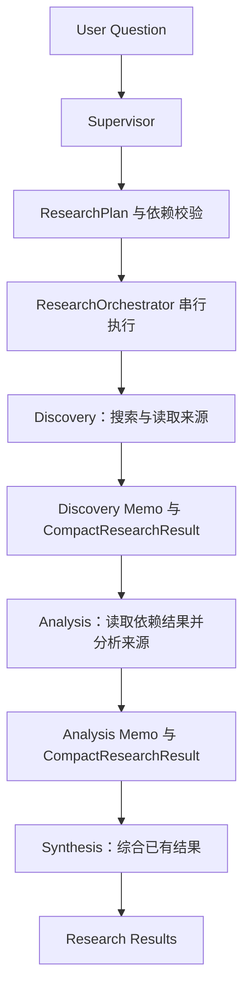
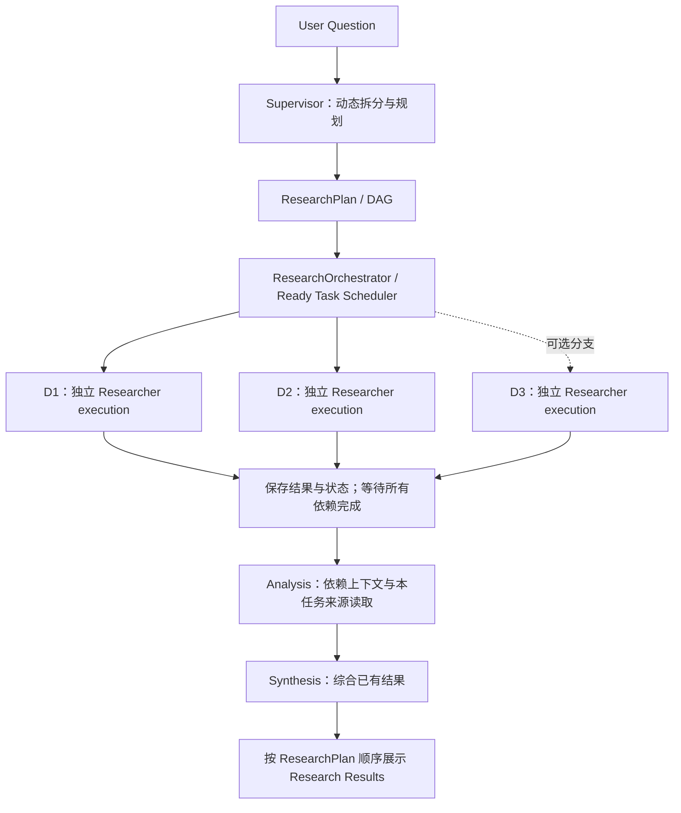

# DeepResearch Agent

## Overview / 项目概览

DeepResearch Agent 是一个面向证据驱动研究的命令行项目：将开放式问题规划为研究任务，搜索并读取外部来源，再经过分析与综合输出研究摘要。

当前已完成 **Phase 1 — Research 基础链路** 和 **Phase 2 — Parallel Research**。系统能够动态生成研究 DAG，按依赖关系并行执行就绪任务，并返回各任务的 Markdown Memo 和结构化压缩结果。正式证据管理、事实验证、带引用的完整报告及持久化将在后续阶段实现。

## Features / 当前能力

- 动态规划：根据问题选择互补的独立 discovery 子问题，生成并校验带依赖的 ResearchPlan。
- 并行研究：按批次执行依赖已满足的任务，使用可配置的并发上限控制 Researcher execution 数量。
- 搜索与读取：通过 Tavily 获取标题、URL 和短摘要，通过 HTTP 与 BeautifulSoup 读取 HTML 来源正文。
- 上下文隔离：每个任务创建独立 Agent、消息历史和 ToolBudget，只接收所依赖任务的压缩结果。
- 多阶段输出：保留 discovery、analysis、synthesis 的职责，最终按计划顺序输出结果。
- 执行可观测性：记录任务 ID、工具与模型请求阶段、结果数量、耗时、等待进度及明确的失败原因。

## Development Phases / 开发阶段

Phase 1 建立完整 Research 主链路；Phase 2 在此基础上升级任务拆分与执行方式。以下先记录已完成阶段，再为 Phase 3～Phase 8 保留统一的目标、范围与验收结构。

### Phase 1 — Research 基础链路

**Status: Completed**

#### 1. Goal / 阶段目标

将用户问题转化为可执行的研究计划，跑通“规划 → 获取资料 → 分析 → 综合 → 输出结果”的完整流程。重点是组件衔接、任务职责和依赖结果传递，执行方式为串行。

#### 2. Architecture / 组件职责

| 组件 | 职责 |
| --- | --- |
| Supervisor | 理解问题并生成研究计划，使用结构化输出或 JSON 回退解析；不负责搜索网页。 |
| ResearchPlan | 保存总体目标 `goal` 和任务列表 `tasks`，通过任务依赖表达研究流程。 |
| ResearchTask | 保存 `id`、`title`、`question`、`description`、`task_type`、`depends_on` 和 `status`。 |
| ResearchOrchestrator | 校验依赖，串行执行依赖已满足的任务，收集结果并更新任务状态。 |
| Researcher | 为当前任务创建独立 DeepAgent，根据任务类型使用工具，生成 Research Memo。 |
| web_search | 获取外部来源的标题、URL 与摘要；搜索结果作为研究线索，不直接生成研究总结。 |
| fetch_webpage | 读取 HTML 页面并提取标题、日期元数据和有限长度的正文。 |
| ToolBudget | 为每个任务单独限制搜索和网页读取次数。 |
| ResearchExecutionResult | 保存单任务的 `memo`、`compact` 和 `tools_used`。 |
| CompactResearchResult | 保存简短摘要、发现、来源与不确定信息，供依赖该任务的后续任务使用。 |
| ResearchResult | 汇总整个计划、各任务 Memo 和压缩结果，供调用者读取。 |

Phase 1 已有依赖字段和依赖校验，计划通常表现为 discovery → analysis → synthesis 的线性链路；这一阶段尚未实现多个任务同时执行。

#### 3. Workflow / 串行研究流程



这是典型流程；任务依赖由计划表达。任务间传递的是压缩结果，不包含前一个 Agent 的工具历史或整页正文。

#### 4. Task Types / 执行职责

| 类型 | 执行职责 | 信息来源 |
| --- | --- | --- |
| `discovery` | 主动搜索新的外部资料，读取重要来源，为后续研究提供发现与来源线索。 | `web_search`、`fetch_webpage`，以及需要时的依赖上下文。 |
| `analysis` | 根据前置结果深入读取相关来源，分析方法、贡献、实验结果、差异或局限；资料不足时可补充搜索。 | 依赖任务的 CompactResearchResult 与本任务读取的来源正文。 |
| `synthesis` | 比较并整合已有发现，形成共识、差异和信息缺口；通常不重新搜索，明确缺口时可在预算内补充。 | 前置任务的压缩结果。 |

这三类任务的职责在 Phase 2 中延续。Phase 1 的来源读取由 Agent 根据提示调用工具，程序在缺少必要调用时提醒并检查；后续的程序预读机制见 Phase 2 的稳定性补充。

#### 5. Result / 阶段成果

Phase 1 已具备问题规划、任务拆分、依赖校验、搜索工具调用、HTML 网页读取、独立任务预算、多阶段 Research Pipeline，以及结构化结果传递能力。

给用户的 Memo 默认使用简体中文，包含“研究任务”“主要发现”“重要来源”“不确定性与缺失信息”四部分。来源条目要求尽量提供标题、URL、可确认的年份或日期、相关性及关键点；未知年份应标为 `unknown`。Markdown 规则从 Memo 提取压缩结果，并对来源标题进行轻量去重。

### Phase 2 — Parallel Research

**Status: Completed**

#### 1. Goal / 阶段目标

在 Phase 1 的 Research 主链路上增加 **Task Decomposition + 独立 Researcher executions + Parallel Research**：先将问题拆为研究 DAG，再并行执行没有前置依赖或依赖已完成的任务。

本项目当前的“SubAgents”能力体现为 Orchestrator 为多个任务分别启动独立 Researcher execution。每次 execution 创建自己的 DeepAgent。当前代码使用 `subagents=[]`，并关闭默认 general-purpose subagent，没有启用 DeepAgents 内部的嵌套子代理或代理间 handoff。

#### 2. What Changed from Phase 1 / 相对 Phase 1 的变化

| 能力 | Phase 1 | Phase 2 |
| --- | --- | --- |
| 任务拆分 | 通常是一条 discovery → analysis → synthesis 链路。 | 根据问题动态生成多个互补、无依赖的 discovery 分支，再分析与综合。 |
| 规划过程 | 直接请求模型生成计划。 | 先识别独立搜索子问题，再生成并校验 ResearchPlan。 |
| 任务数量 | Supervisor 校验 3～6 项任务。 | Supervisor 校验 2～6 项任务，允许简单问题采用 discovery → synthesis。 |
| 计划结构 | 已有依赖字段与 DAG 校验，但常见计划偏线性。 | 显式支持多个独立分支汇合的 Research DAG。 |
| 执行方式 | 就绪任务逐个串行执行。 | 每批选择最多 `max_concurrency` 个就绪任务，同时执行。 |
| Researcher 状态 | 各任务已有独立 Agent 和预算，但同一时间只执行一个。 | 多个独立 execution 同时运行，分别持有消息、预算和依赖结果副本。 |
| 依赖处理 | 依赖结果存在后串行执行下游任务。 | 必须同时满足依赖状态为 `completed` 且结果已保存，才允许进入执行批次。 |
| 并发配置 | 没有并行执行上限参数。 | Orchestrator 构造参数 `max_concurrency`，默认值为 3。 |
| 执行与展示顺序 | 串行执行并打印结果。 | 任务按允许的依赖并行执行，最终结果仍按原始计划顺序输出。 |
| 失败处理 | 当前任务失败后终止流程。 | 等待当前批次收齐结果，保留并展示成功任务，报告失败及未执行任务，停止后续调度。 |

搜索后端切换、analysis 来源预读、超时与进度日志是随后补充的稳定性修复，下面单独说明；它们不属于 DAG 调度本身。

#### 3. Phase 2A — Task Decomposition Upgrade

Supervisor 使用同一个模型完成两步规划：

1. 读取 [decomposition.md](app/prompts/decomposition.md)，根据当前问题识别可独立搜索的互补子问题。
2. 将这些子问题与原始目标、当前日期交给 [supervisor.md](app/prompts/supervisor.md)，生成 ResearchPlan。

子问题数量由研究范围决定，通常选择 2～3 个，最多 4 个；这不是固定领域模板。提示要求每个子问题保留原始问题的完整核心主题、限定对象和时间范围，合并重复或包含关系明显的分支，不把“找论文”和“找综述”等来源体裁当成互补维度。

生成的计划由 Supervisor 校验：

- 总任务数为 2～6；每个任务必须显式提供 `task_type`，初始状态为 `pending`。
- discovery 必须满足 `depends_on=[]`；analysis 和 synthesis 必须依赖已有任务。
- 任务 ID 唯一，依赖不能重复、自引用、指向不存在的任务或形成循环。

典型结构为 D1、D2（必要时增加其他 discovery）→ A → S。简单问题也可以直接使用 discovery → synthesis，不要求固定五个任务。

Phase 2A 当时保留串行 Orchestrator，只升级规划与必要的 schema 描述；真正并行执行由 Phase 2B 引入。主题保持与分支互补由提示约束，当前尚无独立的语义质量验证器。

#### 4. Phase 2B — Parallel Execution

[ResearchOrchestrator](app/research/orchestrator.py) 使用批次式 DAG 调度：

1. 校验计划与初始任务状态。
2. 找出状态为 `pending`、所有依赖已 `completed` 且执行结果已保存的 ready tasks。
3. 按计划顺序选择最多 `max_concurrency` 个任务，置为 `running`。
4. 使用 `asyncio.gather(..., return_exceptions=True)` 并行等待这一批；同步 `Researcher.research()` 通过 `asyncio.to_thread()` 接入。
5. 收集成功结果，任务置为 `completed`；异常任务置为 `failed`，然后判断是否继续下一批。

批次大小直接限制并发数量，当前没有使用 Semaphore。即使某个任务先完成，也要等这一批全部返回后才重新计算 ready tasks。调度器支持依赖允许的任务并行，并不只针对 discovery；生成计划通常将独立 discovery 安排在第一批。

下游任务必须等待其 `depends_on` 中的全部任务完成。例如 A 依赖 D1、D2，S 依赖 A，则 A 不能在 D2 尚未完成时开始，S 也不能在 A 尚未完成时开始。

每个 execution 创建独立 Agent、消息历史、当前任务请求和 ToolBudget。传入的依赖 CompactResearchResult 使用深拷贝，任务间继续通过压缩结果传递信息，不共享前序 Agent 的原始消息。

失败处理保持简单：任一任务失败时，等待当前批次返回、展示成功任务的 Memo、列出失败原因和仍未执行的任务，随后终止运行。当前不继续调度其他批次，也不自动重规划或重跑研究。若仍有 pending tasks 却没有 ready tasks，则明确报错，避免调度循环无限等待。

**后续稳定性补充：**

- 搜索从原来的 DDGS 切换到 Tavily API，保持 `web_search(query, max_results)` 及标题、URL、摘要返回格式；认证、限流、配额、超时和异常结果格式均明确报错。
- analysis 的压缩依赖上下文包含 URL 时，程序在模型执行前预读来源，优先交错选择不同依赖任务的来源，目标为最多 2 个可读页面。失败时在原有 3 次读取预算内尝试其他候选；非空正文才作为有效读取结果。
- 预读与模型后续调用共享同一个预算。成功正文和读取失败原因仅进入当前任务请求；全部来源不可读则明确失败，部分不可读则要求模型说明证据缺口。
- 模型请求默认配置 60 秒 HTTP 超时、0 次自动重试；每项 Researcher 任务默认有 300 秒总时间预算，等待时每 15 秒输出阶段和耗时。任务超时后禁止新的工具与模型调用，丢弃迟到结果；已经发出的同步请求按底层超时收尾，不强行终止线程。

#### 5. Parallel Research Workflow / 并行工作流



图中分支数是示意，实际数量来自 Supervisor 生成的计划；并发上限不要求每批必须填满。

#### 6. Example / 真实运行案例

问题：`调研 sparse reward offline reinforcement learning 的最新研究进展`

一次实际运行生成了以下计划：

| ID | 类型 | 子任务 | 依赖 |
| --- | --- | --- | --- |
| D1 | discovery | sparse reward offline reinforcement learning 在 Atari 游戏上的研究进展 | 无 |
| D2 | discovery | sparse reward offline reinforcement learning 在连续控制任务中的研究进展 | 无 |
| A | analysis | 分析两个方向的已有研究结果 | D1、D2 |
| S | synthesis | 综合总体研究进展 | A |

执行批次为：

```text
Batch 1：D1 + D2 并行执行
Batch 2：A，等待 D1、D2 都完成后开始
Batch 3：S，等待 A 完成后开始
最终展示：D1 → D2 → A → S
```

该次日志中 D1、D2 的工具与模型请求交错出现，A 实际预读 2 个来源，S 未调用 Web，四个任务均完成。此案例验证规划与调度流程；子任务划分是当次模型生成的结果，研究摘要中的年份、主题相关性及论断仍需核验。

#### 7. Result / 阶段成果

Phase 2 新增了动态 discovery 分支拆分、两步规划、宽 DAG、独立 Researcher execution 的并行运行、依赖感知调度、可配置并发上限，以及并发场景下的状态管理、依赖结果隔离和稳定结果展示。

已有 pytest 覆盖多个独立任务重叠执行、超过并发上限时分批、下游等待全部依赖、失败批次结束、结果顺序、状态隔离，以及来源预读和超时处理。Phase 2 的完成范围是规划与执行链路，尚不代表研究内容已经经过事实验证。

### Phase 3 — Evidence System

**Status: Planned / Next**

- **Goal / 目标：** 将研究来源与发现整理为可追溯的证据数据。
- **Planned Scope / 计划范围：** Source、Evidence、Claim、Evidence Store，以及来源与论断之间的关联。
- **Completion Criteria / 预期验收：** 可以按研究任务和论断保存、检索证据，并回溯对应来源。

当前仅定义了基础 Source、Evidence schema；尚未接入证据采集、独立 Claim 模型或 Evidence Store，不构成完整 Evidence System。

### Phase 4 — Verifier Loop

**Status: Planned**

- **Goal / 目标：** 对研究结果进行验证，并围绕具体缺口补充研究。
- **Planned Scope / 计划范围：** Research → Verify → Gap → Re-Research 的反馈循环。
- **Completion Criteria / 预期验收：** 能识别缺少支持或存在冲突的论断，生成补充任务，并保留验证依据。

### Phase 5 — Writer + Citation

**Status: Planned**

- **Goal / 目标：** 将已验证的研究结果组织为完整 Deep Research Report。
- **Planned Scope / 计划范围：** Writer、报告结构、引用关联与引用校验。
- **Completion Criteria / 预期验收：** 报告中的关键论断与可追溯的来源引用对应。

### Phase 6 — Persistence

**Status: Planned**

- **Goal / 目标：** 保存研究状态并支持中断后继续执行。
- **Planned Scope / 计划范围：** Checkpoint、SQLite、研究项目与结果持久化、Resume Research。
- **Completion Criteria / 预期验收：** 重启后能够恢复计划、任务状态和已有结果，继续未完成的研究。

### Phase 7 — Evaluation

**Status: Planned**

- **Goal / 目标：** 定量评估研究系统的质量与执行表现。
- **Planned Scope / 计划范围：** Benchmark、Quantitative Evaluation、可重复的评测流程。
- **Completion Criteria / 预期验收：** 在固定问题集合上比较研究质量、覆盖度与运行表现。

当前工程单元测试用于验证程序行为，不等同于研究质量 Benchmark 或 Evaluation 系统。

### Phase 8 — UI + Docker + README

**Status: Planned**

- **Goal / 目标：** 提供可演示、可部署的项目交付形式。
- **Planned Scope / 计划范围：** UI、Docker、Final Demo、Deployment、Project Packaging 与最终文档整理。
- **Completion Criteria / 预期验收：** 通过统一入口启动项目，并完成演示、部署和使用文档。

## Current Architecture / 当前实现

| 文件或模块 | 当前职责 |
| --- | --- |
| [main.py](main.py) | CLI 入口，读取研究问题并调用同步 `run()`；失败时打印错误并返回非零退出码。 |
| [supervisor.py](app/agents/supervisor.py) | 两步动态规划、结构化输出与 JSON 回退、任务数量、类型、状态和依赖结构校验。 |
| [task.py](app/schemas/task.py)、[plan.py](app/schemas/plan.py) | 定义任务、计划与依赖校验；状态只使用 `pending`、`running`、`completed`、`failed`。 |
| [orchestrator.py](app/research/orchestrator.py) | 批次式 DAG 调度、并发限制、依赖副本、失败汇总及稳定顺序展示。 |
| [researcher.py](app/agents/researcher.py) | 独立任务 Agent、当前问题与依赖上下文、analysis 来源预读、Memo 与压缩结果生成。 |
| [web_search.py](app/tools/web_search.py) | Tavily basic 搜索；结果去重和摘要截断，不返回生成答案或整页原文。 |
| [fetch_webpage.py](app/tools/fetch_webpage.py) | HTML 标题、日期元数据与正文提取；报告不支持的内容类型和访问错误。 |
| [tool_budget.py](app/research/tool_budget.py)、[runtime.py](app/research/runtime.py) | 每任务独立调用预算、截止时间、请求超时约束和阶段日志。 |
| [compact.py](app/research/compact.py)、[context.py](app/research/context.py) | 从 Memo 提取压缩结果，并选择、限制下游依赖上下文。 |
| [source_dedup.py](app/research/source_dedup.py) | 保留约定的 Memo 章节，对来源标题做规范化去重。 |
| [research_result.py](app/schemas/research_result.py) | 定义 SourceSummary、CompactResearchResult、ResearchExecutionResult。 |
| [source.py](app/schemas/source.py)、[evidence.py](app/schemas/evidence.py) | 基础数据结构预留，尚未形成运行中的证据管理系统。 |
| [config.py](app/config.py)、[llm.py](app/llm.py) | 从环境变量和 `.env` 读取配置，集中创建 SiliconFlow ChatOpenAI 模型。 |
| [app/prompts](app/prompts) | 独立保存拆分、计划与 Researcher 指令。 |

## Installation / 安装

需要 Python 3.11+。

```powershell
python -m venv .venv
.\.venv\Scripts\Activate.ps1
python -m pip install -e ".[dev]"
```

macOS/Linux 的激活命令为 `source .venv/bin/activate`。

## Configuration / 环境配置

复制 [.env.example](.env.example) 为 `.env`，填写模型与 Tavily 的密钥。`.env` 已被 Git 忽略。

```dotenv
SILICONFLOW_API_KEY=replace-with-your-api-key
MODEL_NAME=replace-with-a-siliconflow-model-id
SILICONFLOW_BASE_URL=https://api.siliconflow.cn/v1
TAVILY_API_KEY=replace-with-your-api-key
MODEL_REQUEST_TIMEOUT_SECONDS=60
MODEL_MAX_RETRIES=0
RESEARCH_TASK_TIMEOUT_SECONDS=300
RESEARCH_PROGRESS_INTERVAL_SECONDS=15
```

| 配置项 | 说明 | 默认值 |
| --- | --- | --- |
| `SILICONFLOW_API_KEY` | 模型服务密钥，运行研究时必填。 | 无 |
| `MODEL_NAME` | SiliconFlow 提供且支持工具调用的模型 ID，运行研究时必填。 | 无 |
| `SILICONFLOW_BASE_URL` | 模型服务地址。 | `https://api.siliconflow.cn/v1` |
| `TAVILY_API_KEY` | Tavily 搜索密钥，执行搜索时必填。 | 无 |
| `MODEL_REQUEST_TIMEOUT_SECONDS` | 单次模型请求的 HTTP 超时设置。 | `60` |
| `MODEL_MAX_RETRIES` | 模型客户端自动重试次数；不代表自动重跑研究任务。 | `0` |
| `RESEARCH_TASK_TIMEOUT_SECONDS` | 单项 Researcher 任务的总时间预算，含来源读取及模型调用。 | `300` |
| `RESEARCH_PROGRESS_INTERVAL_SECONDS` | 任务等待进度输出间隔。 | `15` |

Supervisor 先尝试 JSON Schema 结构化输出；不支持或校验失败时，请求纯 JSON 并使用 Pydantic 校验。无法获得有效计划时明确报错。

### 并发配置

并发上限在 Orchestrator 初始化参数中配置，CLI 默认使用 3。当前没有对应的环境变量或 CLI 参数。

```python
from app.research.orchestrator import ResearchOrchestrator

orchestrator = ResearchOrchestrator(max_concurrency=3)
result = orchestrator.run("调研 sparse reward offline reinforcement learning 的最新研究进展")
```

### 工具与上下文边界

| 任务类型 | 最大搜索次数 | 最大网页读取次数 |
| --- | --- | --- |
| discovery | 3 | 4 |
| analysis | 2 | 3（包含程序预读） |
| synthesis | 1 | 1 |

每个任务独立计数，工具结果携带剩余预算。超额调用返回明确错误。Agent 每次调用配置 40 步上限，任务总时间预算覆盖该任务的全部调用与补充提醒。

- 搜索默认请求 5 条结果，最多返回 8 条，每条摘要最多 500 字符；Tavily 请求的连接与读取超时分别为 5 秒、30 秒。
- HTML 正文默认最多 5000 字符、调用硬上限 8000 字符，HTTP 超时设置为 15 秒；analysis 预读每页最多 2500 字符。
- 当前任务的初始输入（系统提示、任务、依赖上下文与预读正文）最多 20000 字符；预读来源 JSON 内容还受最多 8000 字符的限制。
- 单个 compact result 的序列化长度目标为最多约 3000 字符，最多 6 条 findings、6 个来源和 4 条不确定信息。
- 单个依赖上下文最多 2800 字符，总依赖上下文最多 8000 字符；过长时缩减依赖内容，保留当前问题，无法容纳必要信息时明确报错。

工具请求超时还会根据任务剩余时间缩短。HTTP 超时限制连接或读取等待，不是整个研究任务的总时限；总时限由 ResearchRuntime 单独管理。任务间只传递 compact result，当前任务自行读取的正文不会作为前序原始历史传给下游。

## Usage / 运行方式

命令行运行：

```powershell
python main.py "调研 sparse reward offline reinforcement learning 的最新研究进展"
```

也可直接运行 `python main.py`，按提示输入问题。终端会显示研究计划、执行批次、任务类型、依赖、依赖上下文字符数、工具与模型阶段、耗时、调用统计、压缩结果字符数和各任务 Memo。

异步应用使用 `arun()`：

```python
from app.research.orchestrator import ResearchOrchestrator

async def research(query: str):
    return await ResearchOrchestrator(max_concurrency=3).arun(query)
```

已经运行事件循环的应用应调用 `arun()`，同步 `run()` 会对此明确报错。成功时返回的 ResearchResult 包含 `plan`、`memos`、`compact_results`；CLI 将结果显示在终端，当前没有自动持久化功能。

## Testing / 工程验证

安装开发依赖后运行离线测试：

```powershell
python -m pytest -q
```

测试涵盖计划与依赖校验、上下文压缩、来源去重、工具返回格式和预算，以及并行调度、并发限制、状态隔离、来源预读和超时处理。真实研究运行另外需要可用的模型服务、Tavily API Key，以及可访问目标网页的网络。

## Current Limitations / 当前限制

- 动态任务拆分和格式要求依赖模型遵循提示，当前没有自动核验各分支的主题覆盖、互补性或研究结论。
- 搜索摘要、非空页面正文和任务 `completed` 都不代表论断已经通过事实验证；年份、方法、实验范围和引用相关性仍需检查。
- 只读取可访问的 HTML 页面，不解析 PDF；网站可能拒绝自动读取，正文截断也可能遗漏关键实验细节。
- Memo 压缩依赖 Markdown 章节规则，模型偏离格式时可能丢失部分来源或细节。来源去重按标题规范化处理，不做论文身份解析。
- 调度按整批等待；一个任务失败后停止后续批次，没有自动重规划、研究任务重试、Verifier Loop 或 Re-Research。
- 任务超时限制调用方等待并阻止后续步骤，不能强行取消正在运行的同步 HTTP 请求；底层请求与框架线程仍需按自身超时收尾。
- 结果保存在内存中并显示到终端；没有 Evidence Store、完整报告 Writer、引用校验系统、checkpoint、SQLite 持久化或恢复执行。

## Roadmap

| 阶段 | 状态 | 范围 |
| --- | --- | --- |
| Phase 1 — Research 基础链路 | Completed | Supervisor、ResearchPlan、Researcher、Search Tool、串行多阶段研究与压缩结果传递。 |
| Phase 2 — Parallel Research | Completed | Phase 2A 动态任务拆分；Phase 2B 独立 Researcher executions、DAG 调度与受限并行执行。 |
| Phase 3 — Evidence System | Planned / Next | Source、Evidence、Claim、Evidence Store 与来源追溯。 |
| Phase 4 — Verifier Loop | Planned | Research → Verify → Gap → Re-Research。 |
| Phase 5 — Writer + Citation | Planned | Deep Research Report、Writer 与引用关联及校验。 |
| Phase 6 — Persistence | Planned | Checkpoint、SQLite、项目持久化与 Resume Research。 |
| Phase 7 — Evaluation | Planned | Benchmark、Quantitative Evaluation 与可重复的研究质量评测。 |
| Phase 8 — UI + Docker + README | Planned | UI、Docker、Final Demo、Deployment、Project Packaging 与最终文档整理。 |

## Project Structure / 项目结构

```text
deepagent/
├── main.py                      # CLI 入口
├── pyproject.toml               # 依赖、安装与 pytest 配置
├── .env.example                 # 环境配置模板
├── app/
│   ├── config.py                # Settings
│   ├── llm.py                   # 模型创建
│   ├── agents/
│   │   ├── supervisor.py        # 动态规划
│   │   └── researcher.py        # 独立任务研究与来源准备
│   ├── prompts/
│   │   ├── decomposition.md     # 独立子问题拆分
│   │   ├── supervisor.md        # ResearchPlan 生成
│   │   └── researcher.md        # 研究职责与 Memo 格式
│   ├── research/
│   │   ├── orchestrator.py      # 批次式 DAG 调度
│   │   ├── runtime.py           # 时间预算与进度日志
│   │   ├── tool_budget.py       # 每任务工具调用预算
│   │   ├── compact.py           # Memo 压缩
│   │   ├── context.py           # 依赖上下文
│   │   └── source_dedup.py      # 来源标题去重
│   ├── schemas/
│   │   ├── task.py              # ResearchTask
│   │   ├── plan.py              # ResearchPlan 与依赖校验
│   │   ├── research_result.py   # Memo 配套的结构化结果
│   │   ├── source.py            # 基础 Source schema 预留
│   │   └── evidence.py          # 基础 Evidence schema 预留
│   └── tools/
│       ├── web_search.py        # Tavily 搜索
│       └── fetch_webpage.py     # HTML 读取
├── tests/                       # pytest 工程测试
└── workspace/                   # 本地运行与诊断产物，除 .gitkeep 外不提交
```
